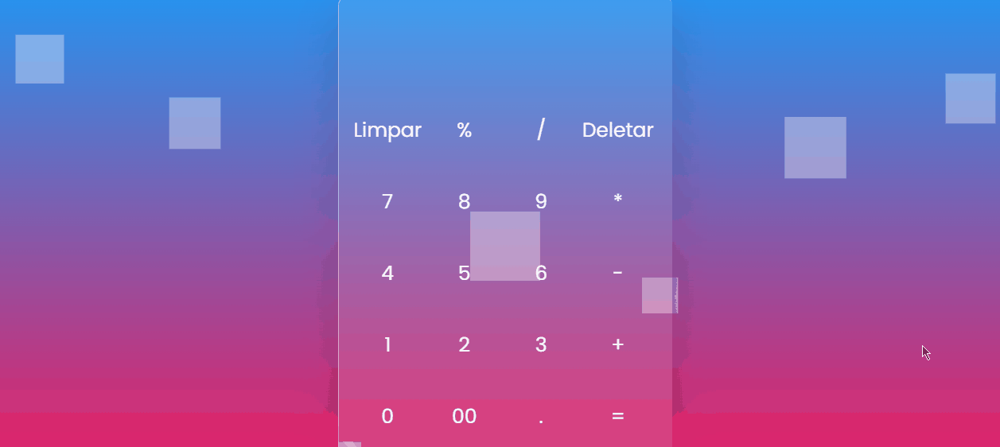
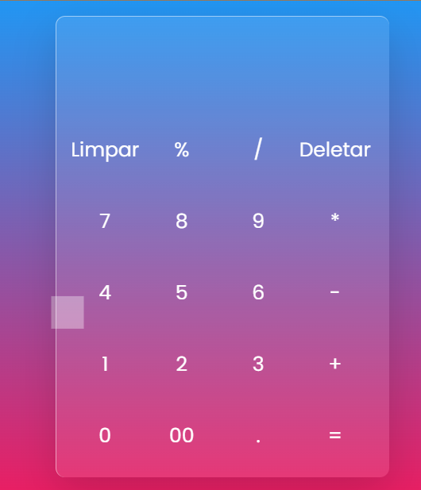
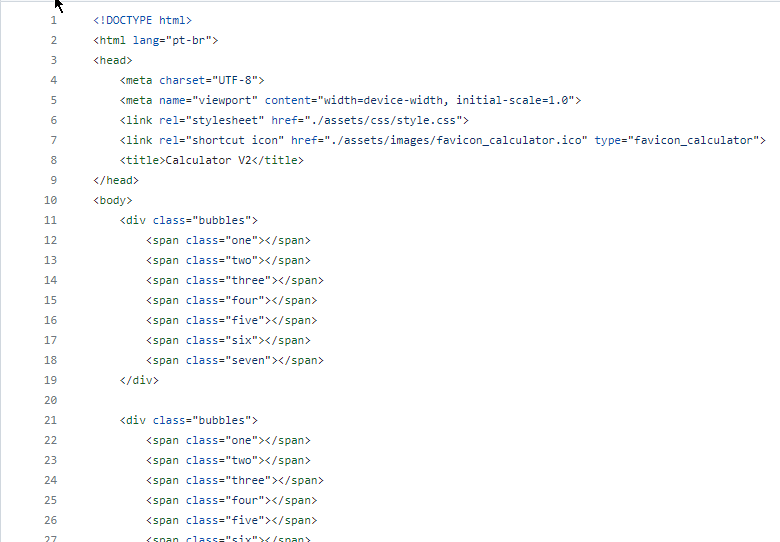
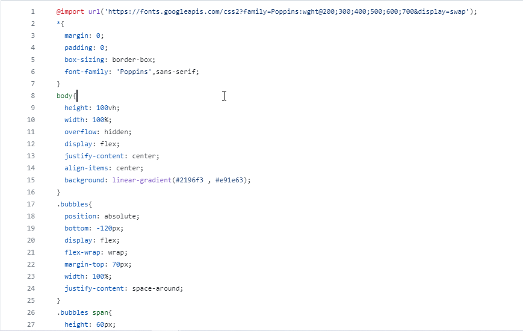
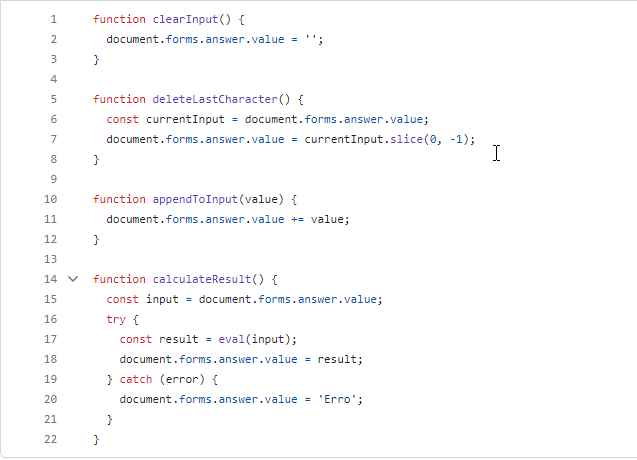

# Project_Calculator_V2

Projeto Calculadora V2 modificada utilizando HTML, CSS e Javascript

# Readme Contents:

- [Summary](#summary)
  - [About the project](#about)
  - [Preview](#preview)
  - [screenshot](#screenshot)
- [My code](#codes)
  - [HTML](#html)
  - [CSS](#css)
  - [Javascript](#js)
- [Process](#process)
  - [Designed](#designed)
- [Autor](#autor)
  - [link](#link)
 
## summary

### about

Nesse projeto foi uma versao modificada do project_Calculator_V1, utilizei uma função chamada <b>Desfoque de fundo (glassmorphism)</b>com esse efeito consegui criar um layout incrivel para esse projeto, utilizei javascript para calcular o valor dos numeros.

### preview

### screenshot

## codes

### html

Code HTML

 

### css

Code CSS

 

### js

Code Js

 

## process

### designed

- Calculator_V1;
- HTML Semantico;
- Código Javascript Simples;
- Prioridades CSS

### learned

🟢 Update Calculator V1  
🟢 Glassmorphin effect  

## autor

### link

**link to acess the project**

